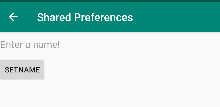

# Rapport

Programmet ska kunna dela preferencer mellan aktiviteter. När man startar programmet
ska man se ett ursprunklig text som det står "still nothing" på se bild 1.
när man startar den andra akivieten så sparas en preferens text som mainaktivitete kan använda 
sig av när den får fokus igen se bild 2.

Nedan ser vi hur man skapar en ny preferens
```
SharedPreferences myShared = this.getSharedPreferences(String.valueOf(R.string.myPreferences), Context.MODE_PRIVATE);
SharedPreferences.Editor editor = myShared.edit();
editor.putString(String.valueOf(R.string.mySharedText), "it's working");
editor.apply();
```

Nedan ser vi hur man hämtar en preferens.
```
myShared = getSharedPreferences(String.valueOf(R.string.myPreferences), Context.MODE_PRIVATE);
String myText = myShared.getString(String.valueOf(R.string.mySharedText), "still nothing");
tv.setText(myText);
```


